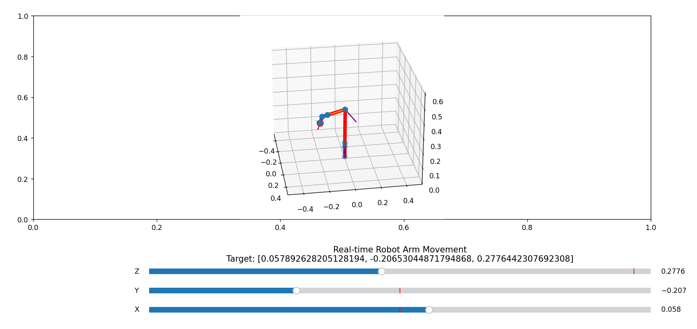

# Project_S (Camera control system for desktop 3d printers)


# 1- Develop Camera Path Mapping Algorithm

## Overview
This project involves the development of a camera path mapping algorithm to create a detailed simulation of camera movements around a 3D model. The simulation is designed to help in visualizing camera coverage for monitoring or inspection purposes, ensuring complete 360-degree visibility of the object being examined.

## Features
- **2D and 3D Visualization**: Utilizes `matplotlib` for dynamic visual representation of camera paths around the 3D model.
- **Interactive Animation**: Includes adjustable parameters for animation speed using sliders, enhancing user interactivity.
- **Camera Path Mapping**: Calculates optimal camera points based on the geometry of the 3D model, providing focused surveillance or inspection capabilities.

## Dependencies
Ensure you have the following Python packages installed:
- `numpy`
- `matplotlib`
- `trimesh`
- `pyglet<2`
- `PyQt5`

You can install these packages via pip:
```pip install numpy matplotlib trimesh pyglet<2 PyQt5```

## File Structure
- `project_s.py` : Contains the main Python script for generating the camera paths and animating them.
- `project_y.py` : Contains the main Python script for generating the camera paths with **timestamps** you can select the time for each cycle.
- `load_display.py` : loads the stl file and generate the camera points.
- `plotting_with_time.py`: plot the path with the time.
- `plotting.py` : plot the path without time.


## Usage
To run this script, make sure you have a 3D model file in STL format. Update the model_path in the script to point to your model file location.
- **Setting up the model path:** `model_path = "path_to_your_model/model_file.stl"`
- **Running the script:** `python project_s.py`
- **Interact with the simulation:**
Use the slider at the bottom of the 3D animation window to adjust the animation speed.
Watch both 2D and 3D animations to understand the camera's coverage.


## Output
- The script will visualize the camera paths in 2D and 3D.
- Camera points are written to camera_points.txt in the current directory, which can be used for further processing or control systems.

## Demo 

| Camera Movement 3D | PyQt5 Demo `project_s.py` |
|--------------------|------------|
|  |  |

|PyQt5 Demo `project_y.py`|
|--------------------|
|  |

| Plotting with Time | Plotting without Time |
|---------------------|-----------------------|
|  |  |


# 2- Control 
## Real-time Robot Arm Movement Visualization + IK

### The name of the Robot is **CAMBOT**.

- `plot_CAMBOT.py`
- `path_plot.py`
- `plot_with_camera.py`
This Python scripts uses the PyBullet physics engine to simulate interactions between a robot and an object in a 3D environment. It demonstrates the loading of a robot from a URDF file, setting up joint controls, and capturing and logging various simulation data.

## Dependencies

- **PyBullet**: A Python module used for physics simulations in robotics, games, and visual effects.

## Setup and Execution

### Initial Setup

Import necessary modules and define the main functions used for loading the robot and object, setting up joint control, and running the simulation.

```python
import pybullet as p
import time
import pybullet_data
```
## Functions

- `load_robot_and_object`: Initializes the simulation environment, loads the robot, and creates an object.
- `setup_joint_control`: Sets up joint control for the robot.
- `simulate_and_capture`: Runs the simulation, capturing joint states and end-effector positions.


### Demos for the control 
| Robot EE Path  | PyBullet Simulation `plot_CAMBOT.py` |
|--------------------|------------|
|  |  | 


| Robot Work Space `work_space.py` | IK  `ik.py` |
|--------------------|------------|
|  |  | 
